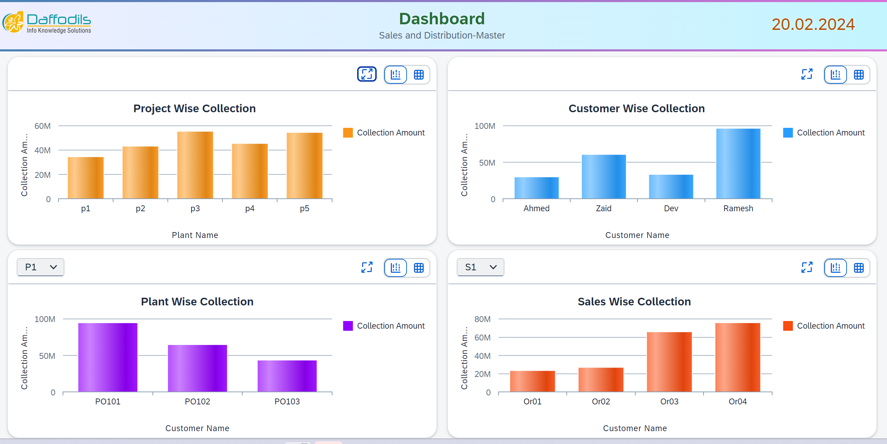
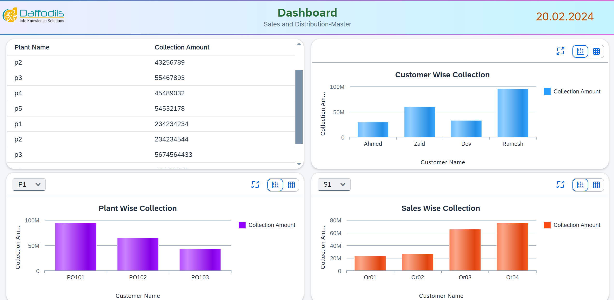
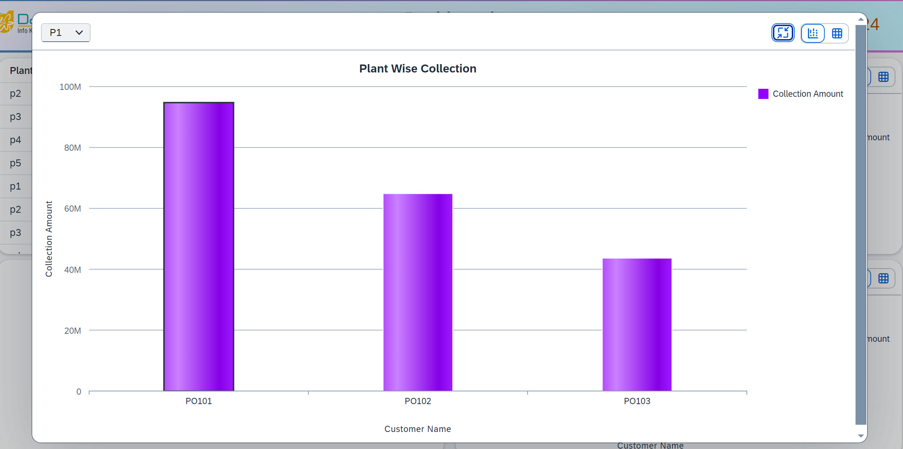
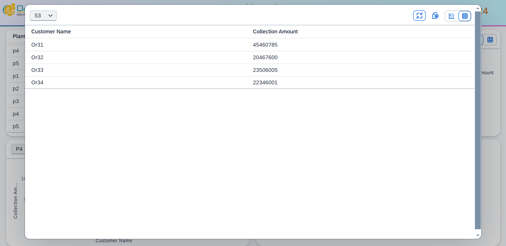

# Dashboard-SAPUI5
<h1>Application View </h1>
<h2>* Main Page to show all detail like ProjectWise Collection and  CustomerWise Collection </  PlantWise Collection and  SaleWise Collection</h2>

<h2>Show Table Plant Name and Collection Amount </h2>

<h2> Show Chart in Maximum View </h2>

<h2>Also Show Table in Maximum View </h2>

<h2>End🫡</h2>